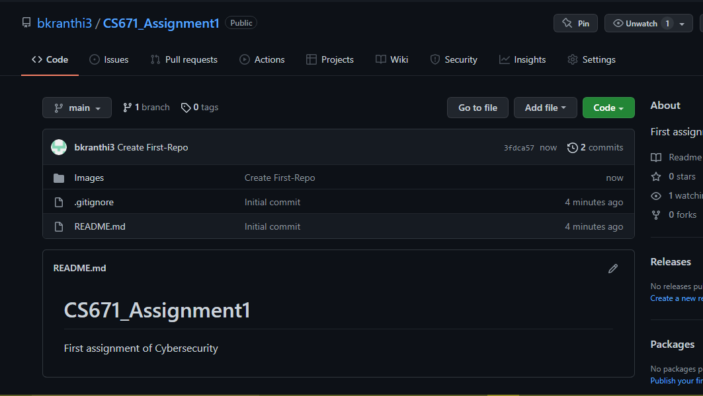
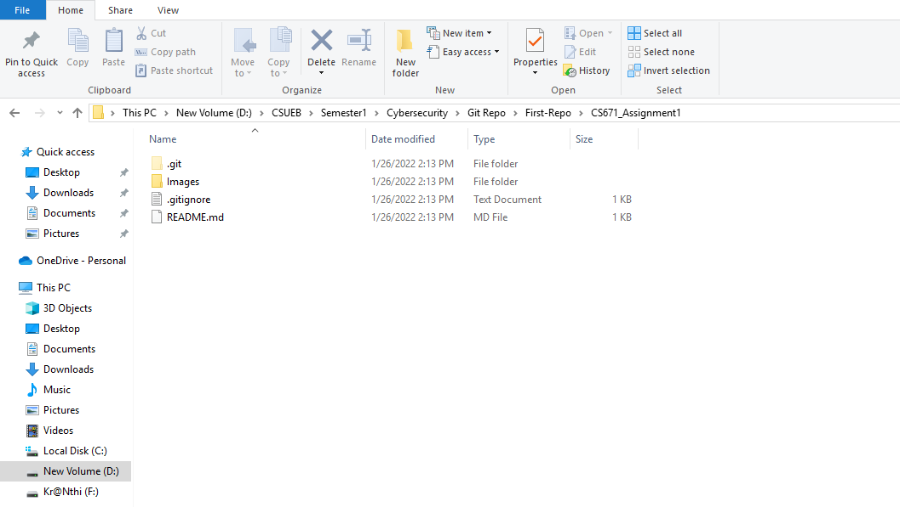
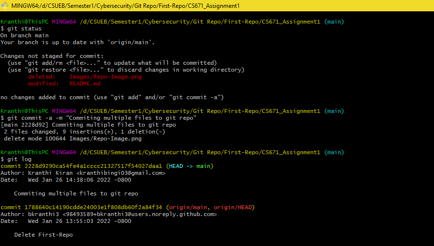
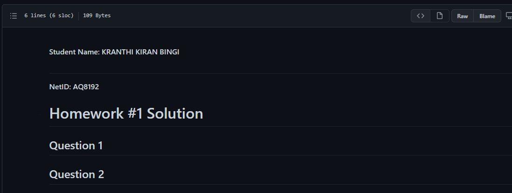
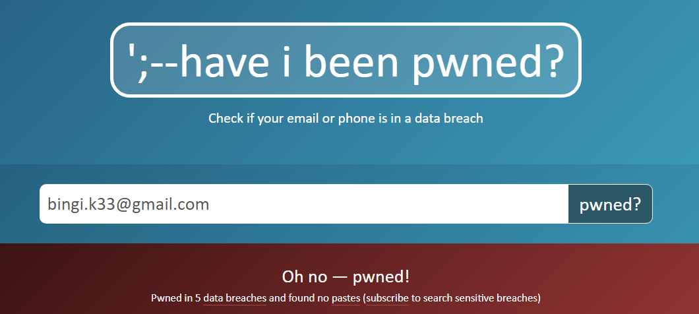

**Student Name:** KRANTHI KIRAN BINGI
#
**NetID:** AQ8192
#
# Homework #1 Solution
## Question 1
### 1(a)

### 1(b)

## Question 2
### 2(a)
#
#
#
#
### 2(b)

### 2(c)

#
#
#
## Question 3
### 3(a)

### 3(b)
Credential stuffing is a cyber attack in which the attacker breaches into victim's system by setting up bots to attempt a login to a service by passing different combination of compromised user names and passwords that are stored in credential databases.
* (a)
"Big Basket" has suffered a data breach in October 2020, all my sensitive information like Username, Password, Date of Birth, IP address have been breached. So I have to be concerned with credential stuffing attack.

### 3(C)
## Avoiding Credential Stuffing
To prevent credential stuffing, The service provider or Businesses should play an important role and it is also a responsibility of an individual to not to use common credentials for any sensitive services like Banking, Academics, Gmail e.t.c.
 ### Reponsibility of Businesses to prevent credential stuffing
 * Store only the required amount of data and reduce the unnecessary data.
 * Minimizing the number of places to store private data.
 * Mandate any kind of unencrypted data transmissions.
 * Restrict the user to set strong passwords.
 * Keeping any security softwares upto date.

## Question 4
### 4(a) The White and the Black
Hackers are universally categorised by different colour hats and each colour refers their motivations and actions.
* White Hat Hackers - White Hat Hackers usually called as an Ethical hacker, this type of hackers finds the vulnerabilities that may find out by
	 the threat actor and hack networks only if it is legally permitted to do so.
* Black Hat Hackers - A Black Hat Hacker is someone who malicously searches for and exploit vulnerabilities in networks or systems using malwares. this type of hackers break the laws as part of their hacking exploits for monetary gain or to steal data.

#
#

### 4(b) The Red and the Blue
* Eventhough the responsibility of both the teams is to protect the security of organization, the duties of both the teams are different. 
* Red team "Finds" and Blue team "Fixes".
* The Red Team is the group of security professionals who works on finding the vulnerabilities in security of the company by hacking organization's networks and system, where as the blue team works on patching up the vulnerabilities that are found by red team and respond to attacks on an organization's security.

#
#

### 4(c) Kiddies and APT's
A Kiddie can also be referred as 'Script Kiddie', A script kiddie is an unskilled individual who uses existing softwares or shell scripts to hack the target system. Script kiddies were lack of experience to write their own script.
APT is abbrevated as Advanced Persistent Threat and this attack is performed by an individual bad actor or the group of bad actors who establishes long term presence on network in order to retrieve the highly sensitive data.
In APT, intruders are very careful in choosing their targets like governement and large enterprise networks.
* APT's are skilled enough to write up their own scripts where as kiddies use the existing one's.
* Script kiddies won't cause much damage and they are young attackers who never evolved into full time hacking.

## Question 5
### 5(a) Classified Data (Government)
The purpose of classification of information on different levels is to protect information. In the US government, the information levels are classified based on the amount of damage that would cause incase of any disclosure of such information. 

In addition to a security clearance, user of the information should also clear the secret clearance, top secret clearance and specific word clearance for sensitive compartmented information.

Sensitive compartmented information is protected by code word so that only who cleared for each code word and all security clearances can see such information. If the data is comparted with code "SECRET" a particular user has to clear that specific word clearance to view or use the information.
#
#
## 5(b) Classified Data (Student)
#
#
## 5(c) System Types IT vs. OT
* Operational Technology is system in which it is connected to any physical device and Information technology is the system that is connected to network.

* Operational technology systems detect or cause a direct change through monitoring and control of devices where as Information technology can be monitored through network.

* Operational technology as a categoriy both are into manufacturing, ICS is combination of control components.

* ICS is used in electrical, water and wastewater, oil and natural gas, chemical, transportation, pharmaceutical, pulp and paper, food and beverage, and discrete manufacturing industries.

* Before ICS components were in physically secured areas and these devices were not connected to any network. (eg: cars) but now devices are having proprietary solutions, which increases possibility of cybersecurity vulnerabilities.

* No,Dams and Nuclear Sectors are the example that critical infrastructure doesn't always involve ICS. 
